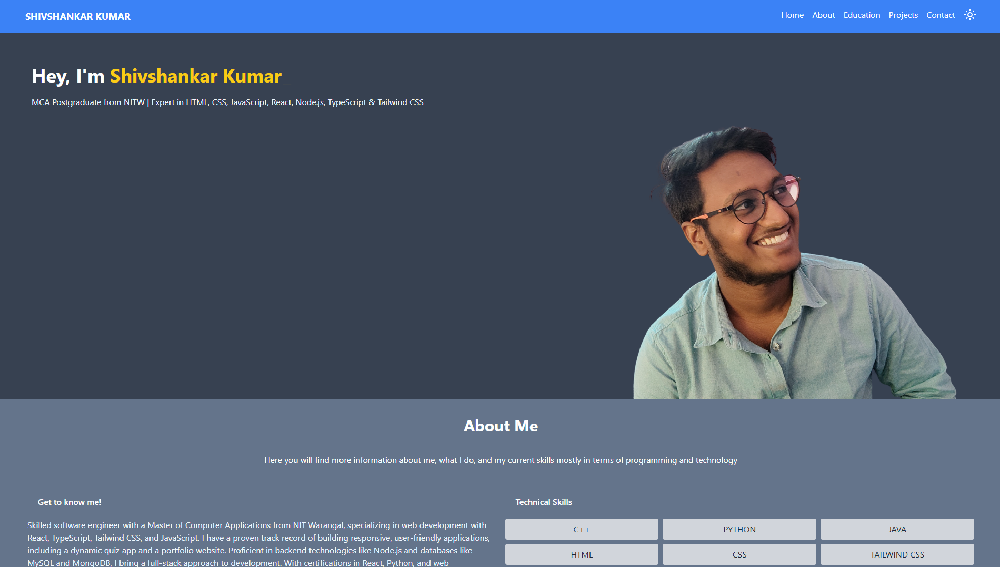
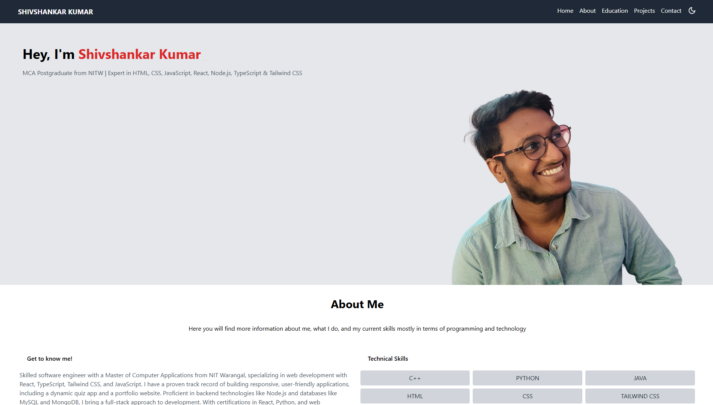

# Portfolio Website

This is my personal portfolio website showcasing my skills, projects, and experience as a software engineer. The website is built using HTML, CSS, JavaScript, React, Tailwind CSS, and TypeScript to create a clean, modern, and responsive design.
## Features

- **Home**: Introduction with a welcoming message and a brief overview of my skills and expertise.
- **About**: Detailed information about my background, education, and technical skills.
- **Projects**: Showcase of selected projects with descriptions, technologies used, and links to their GitHub repositories.
- **Contact**: Links to my social media profiles and a way to get in touch with me.
- **Dark Mode**: Allows users to switch between light and dark themes.

## Technologies Used

- HTML
- CSS
- JavaScript
- React
- TypeScript
- Tailwind CSS

## Installation

To run this project locally:

**1**. Clone the repository: 
```bash
  git clone https://github.com/shivshankar7004/portfolio.git

```
**2**. Navigate to the project directory: 
```bash
  cd portfolio

```
**3**. Install the dependencies: 
```bash
  npm install

```
**4**.Start the development server:
```bash
  npm run dev

```
**5**. Open your browser and go to http://localhost:3000 to view the website.

## Portfolio Section

- **Introduction**: Brief intro with a photo, name, and a tagline.
- **Technical Skills**: A list of technical skills grouped by languages, frameworks, tools, etc.
- **Projects**: Highlighted projects with descriptions and links.
- **Contact Information**: Links to social profiles and a way to reach me directly.
## Screenshots

**Dark Mode**:



**Light Mode**:




## License

This project is open-source and available under the [MIT](https://choosealicense.com/licenses/mit/) License.


## Contact

If you have any questions or suggestions, feel free to reach out through the Contact section on the [website](https://shivshankar7004.github.io/portfolio/) or connect with me on [LinkedIn](https://www.linkedin.com/in/shivshankar-kumar-0755a11b0/).
